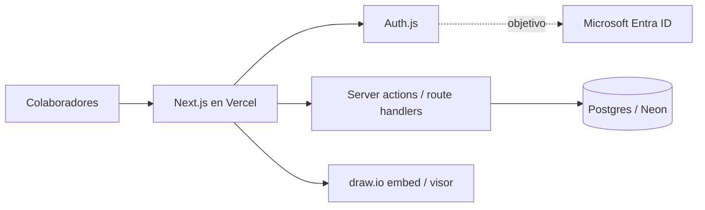

# Arquitectura — Repositorio de Procesos SABBI

Diseño técnico del proyecto. Para el alcance del demo ver `CLAUDE.md` sección 2; para el detalle funcional ver `procesos.md`.

## 1. Visión general



Aplicación monolítica Next.js (frontend + backend en el mismo proyecto), Postgres como única fuente de datos, draw.io embebido para crear y ver diagramas, y Auth.js como capa de identidad intercambiable.

## 2. Componentes

- **Frontend (Next.js App Router):** las tres vistas (registro, aprobación, consulta).
- **Backend (server actions / route handlers):** validación, persistencia, lógica de estados. Todo el acceso a datos ocurre aquí.
- **Base de datos (Postgres/Neon):** procesos, usuarios, áreas, proyectos, aprobaciones.
- **Auth.js:** sesión e identidad. Provider simple en demo, Entra ID en objetivo.
- **draw.io:** editor embebido (carril A) y visor de solo lectura (carril B).

## 3. Modelo de datos

```
usuarios(id, email, nombre, cargo, area_id, es_aprobador)
areas(id, nombre)
proyectos(id, nombre, area_id)
procesos(id, nombre, descripcion?, notas?, area_id, proyecto_id?, autor_id,
         aprobador_id, estado, contenido_xml, fecha)
aprobaciones(id, proceso_id, aprobador_id, decision, comentario, fecha)
```

Relaciones: `proyectos.area_id → areas`; `procesos` referencia área, proyecto (opcional), autor y aprobador (todos hacia `usuarios`/`areas`/`proyectos`); `aprobaciones.proceso_id → procesos`. `estado ∈ {PENDIENTE, APROBADO, RECHAZADO}`.

Regla clave: el aprobador siempre es una fila real de `usuarios` (un login), nunca texto libre. En el demo esa tabla se siembra a mano; en el objetivo la llena Entra ID.

## 4. Flujo de datos por carril

- **Carril A (registro):** formulario → validación en servidor → `procesos` con `estado=PENDIENTE` → registro en `aprobaciones` al decidir.
- **Aprobación:** el aprobador lee sus pendientes → aprueba (`APROBADO`) o rechaza (`RECHAZADO` + comentario, vuelve al autor).
- **Carril B (consulta):** buscador + filtros leen solo procesos `APROBADO` → visor renderiza `contenido_xml`.

## 5. Autenticación: demo vs objetivo

- **Demo:** provider simple de Auth.js; el usuario de sesión se mapea a una fila de `usuarios`.
- **Objetivo:** Entra ID (OIDC); requiere registrar la app en el tenant de SABBI. Cambio de config, no de lógica.
- El auth se aísla en `/lib/auth` para que el swap no toque el resto.

## 6. Almacenamiento y render del diagrama

El diagrama se guarda como XML draw.io sin comprimir en `procesos.contenido_xml` (TEXT). El mismo XML alimenta el editor (A) y el visor (B). Validación al guardar: parseo + apertura en el visor; si falla, se bloquea.

## 7. Búsqueda y filtros

- Búsqueda por nombre y descripción con `ILIKE '%término%'` (suficiente para el MVP).
- Filtros por área, proyecto y autor (selección, leen de listas controladas).
- Escalamiento futuro: `pg_trgm` o full-text search si el volumen lo exige.

## 8. Despliegue

- **Demo:** Vercel (Hobby), desde el repo de GitHub, con `DATABASE_URL` de Neon en variables de entorno.
- **Objetivo:** entorno del equipo de tech. Next.js corre como servidor Node o contenedor; la migración es redeploy, no reescritura.

## 9. Variables de entorno

- `DATABASE_URL` — Postgres (Neon en demo).
- `AUTH_SECRET` — Auth.js.
- Provider simple: la llave que aplique (correo/SMTP para magic-link, o credenciales de prueba).
- Objetivo: `AUTH_MICROSOFT_ENTRA_ID_ID`, `_SECRET`, `_ISSUER`.

Todas en `.env` (no commitear) y documentadas en `.env.example`.

## 10. Controles ISO 27001 (Anexo A) mapeados

- A.5.15 / A.5.16 / A.8.5: control de acceso, identidades, autenticación segura.
- A.5.3: segregación de funciones (autor ≠ aprobador).
- A.8.15: registro y trazabilidad del cambio de estado (tabla `aprobaciones`).
- A.5.18: derechos de acceso, aprobación formal por rol.
- A.8.3: solo los procesos aprobados son visibles.

Nota: ISO 27001 no define símbolos de diagrama; el flujograma del proceso (`proceso-repositorio-sabbi.drawio`) usa convención ISO 5807.

## 11. Portabilidad

Ver `CLAUDE.md` sección 9. Resumen: `DATABASE_URL`, runtime Node, sin piezas propietarias de Vercel/Neon en la lógica, esquema en migraciones Prisma. Migración de datos Neon→tech = `pg_dump`/`pg_restore`.

## 12. Decisiones y trade-offs

- **draw.io en vez de Mermaid:** trae editor visual, quita la barrera de sintaxis; el colaborador ajusta arrastrando. El XML es texto, se guarda igual.
- **Neon:** Postgres real, plan free suficiente para el MVP; cold start por scale-to-zero, aceptable para uso interno.
- **Vercel Hobby:** solo para el demo. Producción interna real requeriría Pro o el entorno de tech (Hobby es uso no comercial).
- **Auth.js:** modular, permite demo simple hoy y Entra ID después sin reescritura.
