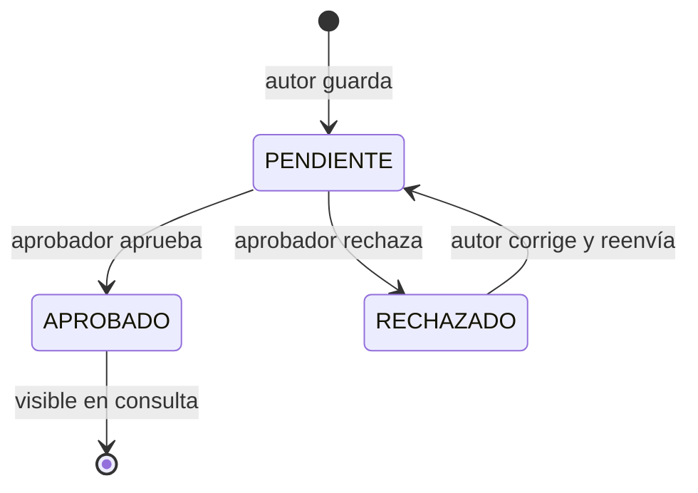

# Procesos — Especificación funcional

Qué hace la plataforma, desde la perspectiva de negocio. El diseño técnico está en `arquitectura.md`; las reglas para el desarrollo en `CLAUDE.md`.

## 1. Actores

- **Colaborador A (autor):** documenta un proceso que domina.
- **Jefe de área (aprobador):** valida los procesos que le asignan.
- **Colaborador B (consulta):** busca y consulta procesos ya aprobados.

Un mismo usuario puede tener varios roles. El aprobador siempre es un usuario real del sistema.

## 2. Carril 1 — Registro (Colaborador A)

Formulario con campos, casi todos por selección para mantener datos limpios:

- **Colaborador (autor)** y **fecha:** automáticos (sesión del usuario).
- **Nombre del proceso:** obligatorio.
- **Descripción:** opcional. El "qué es". Se usa también en la búsqueda.
- **Notas:** opcional. El "cómo ejecutarlo" (dependencias, dueños de insumos). No entra a la búsqueda.
- **Área:** obligatorio, desplegable (lista controlada).
- **Proyecto:** opcional, desplegable filtrado por área, con opción "General".
- **Aprobador:** obligatorio, desplegable de usuarios que pueden aprobar.

Diagrama: el autor genera el XML del proceso (con ayuda de su Claude), lo importa en el editor draw.io embebido, lo ajusta y guarda. Al guardar, el proceso queda en estado **PENDIENTE**. Se valida el XML antes de persistir.

## 3. Aprobación (Jefe de área)

El aprobador ve sus procesos pendientes en una bandeja y decide:

- **Aprobar** → estado **APROBADO**. El proceso se publica y es visible en el carril B.
- **Rechazar con comentario** → estado **RECHAZADO**. Vuelve al autor para corregir.

Solo los procesos APROBADO son visibles públicamente. Cada decisión queda registrada (autor, aprobador, decisión, comentario, fecha).

## 4. Carril 2 — Consulta (Colaborador B)

- **Buscador** por nombre y descripción.
- **Filtros** por área, proyecto y colaborador autor.
- Al abrir un proceso: descripción, notas y el diagrama renderizado en modo lectura (visor draw.io).

El colaborador B no edita nada; solo consulta procesos oficiales y aprobados.

## 5. Máquina de estados

## 6. Reglas de negocio

- El aprobador es siempre un usuario real (login), no texto libre.
- Segregación de funciones: el autor no puede ser su propio aprobador.
- Solo procesos APROBADO aparecen en la búsqueda del carril B.
- El diagrama se guarda como XML draw.io sin comprimir; se valida al guardar.
- Descripción entra a la búsqueda; notas no.

## 7. Datos sembrados (demo)

Para que la búsqueda y los filtros se vean poblados:

- usuarios: 3-4 (autores + al menos un aprobador).
- áreas: 2-3 (ej. Finanzas, Operaciones, Tecnología).
- proyectos: 2-3.
- procesos: 4-5 ya aprobados, con diagrama.

## 8. Referencia visual

El flujo completo end-to-end (registro, aprobación, consulta) está diagramado en `proceso-repositorio-sabbi.drawio`, con carriles por actor y los puntos de control ISO 27001 anotados.
